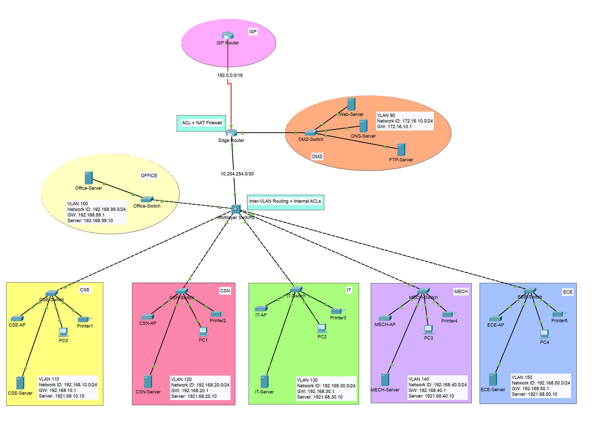

# Network Design

## Architecture

The network uses a core-and-access design:

1. `ISP-Router` represents an upstream provider and exposes a loopback address for simulated external testing.
2. `Edge-Router` connects the internal core to the DMZ and simulated ISP. It performs NAT and applies the outside-in ACL.
3. `Multilayer Switch0` hosts the department and office SVIs and routes between VLANs.
4. Department access switches connect the lab endpoints and departmental server.
5. The DMZ contains separate Web, DNS, and FTP servers.

## Addressing plan

| VLAN / segment | Subnet | Gateway |
|---|---|---|
| Office (100) | `192.168.99.0/24` | `192.168.99.1` |
| CSE (110) | `192.168.10.0/24` | `192.168.10.1` |
| CSN (120) | `192.168.20.0/24` | `192.168.20.1` |
| IT (130) | `192.168.30.0/24` | `192.168.30.1` |
| MECH (140) | `192.168.40.0/24` | `192.168.40.1` |
| ECE (150) | `192.168.50.0/24` | `192.168.50.1` |
| DMZ | `172.16.10.0/24` | `172.16.10.1` |
| Core–edge transit | `10.254.254.0/30` | Edge `10.254.254.1`, core `10.254.254.2` |
| Edge–ISP | `192.0.2.0/30` | Edge `192.0.2.2`, ISP `192.0.2.1` |

### DMZ servers

| Service | Address |
|---|---|
| Web | `172.16.10.10` |
| DNS | `172.16.10.20` |
| FTP | `172.16.10.30` |

## Server roles

- Departmental servers provide DHCP for their respective VLANs.
- DMZ Web, DNS, and FTP servers provide the configured public-facing services.
- The Office/Main server uses `192.168.99.10`; ICMP echo requests are restricted by an ACL.

## Notes

This is a Packet Tracer simulation. The ISP router and `203.0.113.1` loopback are test endpoints, not a connection to the public Internet.
